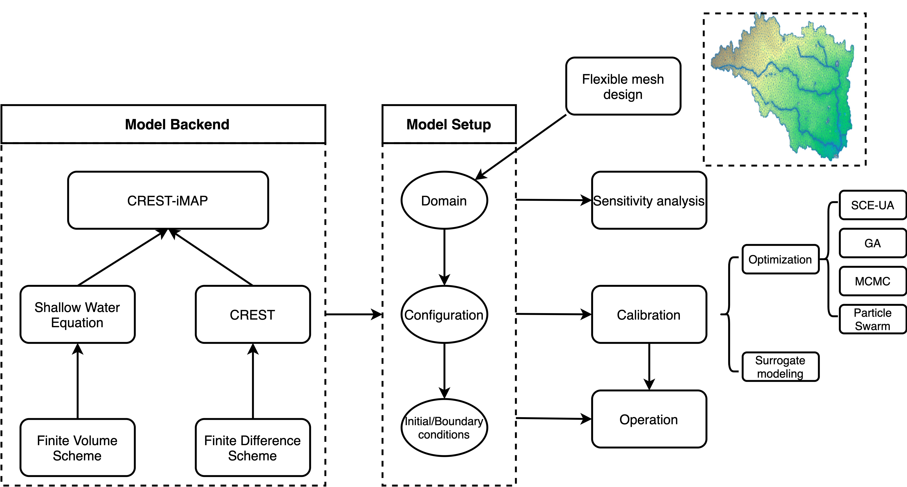
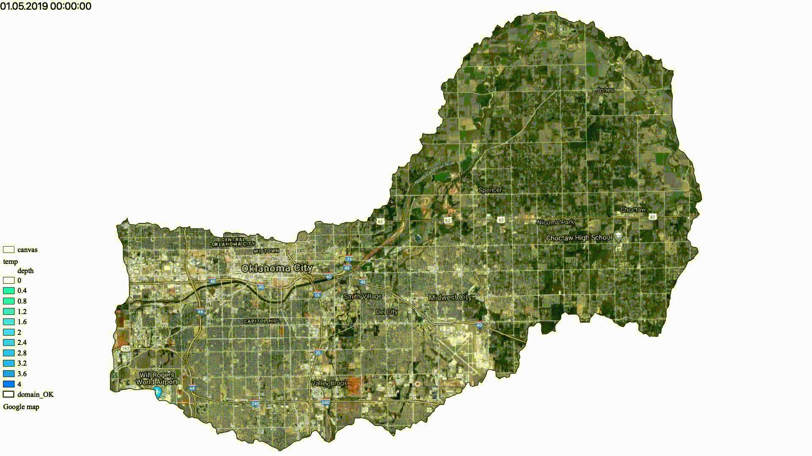
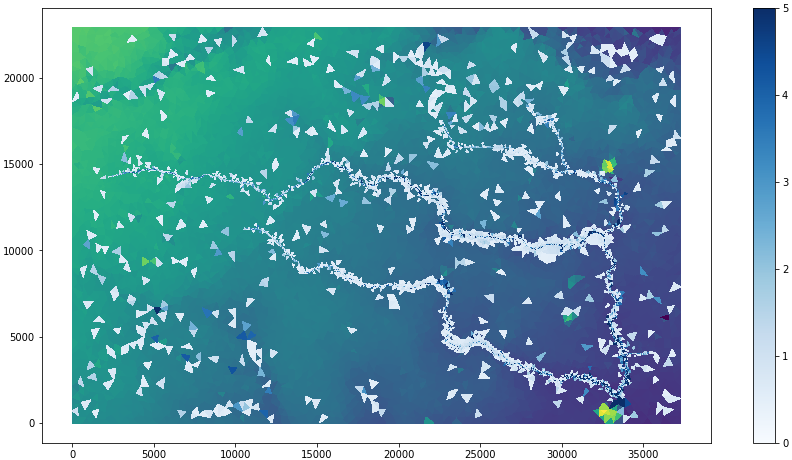
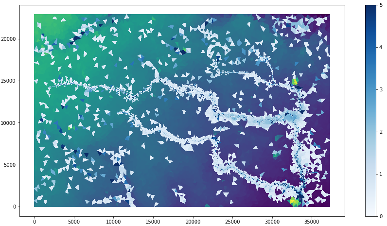

[](https://www.python.org/downloads/release/python-275/)  
[](https://colab.research.google.com/drive/1wTq3vaiQwJeLoqe4YMnyzV4ZQ6pvOez1?usp=sharing)  (deprecated)  
[](https://mybinder.org/v2/gh/chrimerss/python2-binder/HEAD) (recommended)  
[](https://www.sciencedirect.com/science/article/pii/S1364815221000943)  

# CREST-iMAP

## Coupled Routing Excess STorage inundation MApping and Prediction
<p align="center">

</p>


# Introduction

**Model Framework:**



The CRESTH/H model framework integrates hydrologic model (CREST) and hydrodynamic model (anuga) to target heavy rainfall-induced flash flood.

Taking advantage of two models, CRESTHH is capable of simulating hydrologic streamflows, flood extend, flood depth, pushing the territory of traditional 1D streamflow simulation to 2D (extent) and 3D (depth).

## Powerful features

1. __Flash flood inundation__

2. __Hydrologic simulation__

3. __Coastal flooding (Tsunami, wave dynamics)
Impact of hydraulic structures (e.g., dam breaks)__

4. __A set of uncertainty/sensitivity analysis__

5. __Easy to use (can setup in Jupyter notebook)__

6. __Parallel computing__

7. __Efficiency (bottlenecks in C)__

8. __Flexible/Optimal mesh design__

# Installation

## Prerequisites

1. Python 2.7
2. pypar
3. GDAL>=2.2.3
4. mesher
5. Cython>=0.25

This package is not migrated to python 3 yet. We recommend to use virtualenv or conda environment to create a standalone environment to install this package.

```
pip install -r requirements.txt
```
## Manual installation

```bash
virtualenv env -p=python2.7
source env/bin/activate
cd pypar & python setup.py install
cd cresthh/crest & python setup.py install
pip install proj affine matplotlib pandas scipy netCDF4==1.5.3 geopandas

```

Using mamba and conda (recommended)
```
mamba create -n python2 python=2.7
mamba env update -n python2 -f environment.yml
```

## Cloud simulation

Please click "Open in Google Colab" badge on top to utlize Google Colab online computing system (only at single core).

# Updates

- [x] 2020.06.17 Add options to create longitudinal profile and animation


- [x] 2020.06.17 Add options to create soil moisture animation


- [x] 2020.06.23 Created interface to read .mesh file from mesher. Therefore, it supports creating mesh by considering the heterogeneity of the topography/river networks and so forth.

- [x] 2020.11.12 Pre-simulation for OKC flooding



- [x] 2021.02.07 CREST-iMAP V1.1: support reinfiltration
e.g.  
```python
DOMAIN.set_reinfiltratin(True)
```

The difference between turn on reinfiltration (left) and turn off reinfiltration (right) is obvious:



# TODO

- [ ] Add support for canopy interception
- [ ] Create Docker file to better minimize the installation process
- [ ] Option to provide land cover data and infer friction
- [ ] Complete examples for each feature

# Citation

Li, Z., Chen, M., Gao, S., Luo, X., Gourley, J., Kirstetter, P., Yang, T., Kolar, R., McGovern, A., Wen, Y., Rao, B., Yami, T., Hong, Y., 2021. CREST-iMAP v1.0: A fully coupled hydrologic-hydraulic modeling framework dedicated to flood inundation mapping and prediction, Environmental Modelling and Software, 141, 105051.

Li, Z., Chen, M., Gao, S., Wen, Y., Gourley, J. J., Yang, T., Kolar, R., & Hong, Y. (2022). Can re-infiltration process be ignored for flood inundation mapping and prediction during extreme storms? A case study in Texas Gulf Coast region. Environmental Modelling & Software, 155, 105450. https://doi.org/10.1016/j.envsoft.2022.105450
