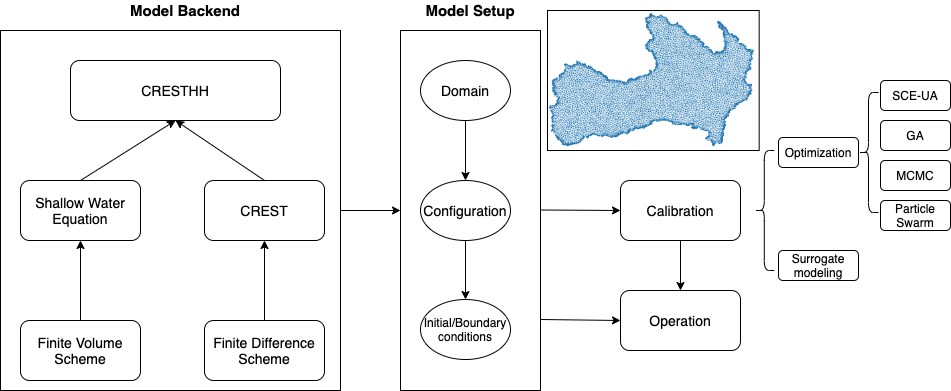

[](https://www.python.org/downloads/release/python-275/)

# CRESTH/H

## Coupled Routing Excess STorage Hydrologic/Hydrodynamic modeling framework


# Introduction

**Model Framework:**



The CRESTH/H model framework integrates hydrologic model (CREST) and hydrodynamic model (anuga) to target heavy rainfall-induced flash flood.

Taking advantage of two models, CRESTHH is capable of simulating hydrologic streamflows, flood extend, flood depth, pushing the territory of traditional 1D streamflow simulation to 2D (extent) and 3D (depth).

## Powerful features

1. __Flash flood inundation__

2. __Hydrologic simulation__

3. __Coastal flooding (Tsunami, wave dynamics)
Impact of hydraulic structures (e.g., dam breaks)__

4. __A set of uncertainty/sensitivity analysis__

5. __Easy to use (can setup in Jupyter notebook)__

6. __Parallel computing__

7. __Efficiency (bottlenecks in C)__

8. __Flexible/Optimal mesh design__

# Installation

## Prerequisites

1. Python 2.7
2. pypar
3. GDAL>=2.2.3
4. mesher
5. Cython>=0.25

This package is not migrated to python 3 yet. We recommend to use virtualenv or conda environment to create a standalone environment to install this package.

```
pip install -r requirements.txt
```
## Model setup

```python
from cresthh import anuga
domain= anuga.create_domain_from_regions(coords, boudndary_tags, minimum_triangle_area)
domain.set_name('test')
domain.set_proj("+proj=utm +zone=15, +north +ellps=WGS84 +datum=WGS84 +units=m +no_defs")   #define projection of forcing data
domain.set_quantity('elevation', filename=topography_file, location='centroids') # Use function for elevation
domain.set_quantity('friction', 0.03, location='centroids')                        # Constant friction 
domain.set_quantity('stage', expression='elevation', location='centroids')         # Dry Bed 
domain.set_quantity('SS0', 0, location='centroids')
domain.set_quantity('SI0', 0, location='centroids')
domain.set_quantity('W0', 0, location='centroids')
domain.set_quantity('RainFact', 0.5, location='centroids')
domain.set_quantity('Ksat', 0.5, location='centroids')
domain.set_quantity('WM', 0.5, location='centroids')
domain.set_quantity('B', 0.5, location='centroids')
domain.set_quantity('IM', 0.5, location='centroids')
domain.set_quantity('KE', 0.5, location='centroids')
domain.set_quantity('coeM', 0.5, location='centroids')
domain.set_quantity('expM', 0.5, location='centroids')
domain.set_quantity('coeR', 0.5, location='centroids')
domain.set_quantity('coeS', 0.5, location='centroids')
domain.set_quantity('KS', 0.5, location='centroids')
domain.set_quantity('KI', 0.5, location='centroids')
domain.set_evap_dir('/home/ZhiLi/CRESTHH/data/evap', pattern='cov_et17%m%d.asc.tif', freq='1D')
domain.set_precip_dir('/hydros/MengyuChen/mrmsPrecRate',pattern='PrecipRate_00.00_%Y%m%d-%H%M00.grib2-var0-z0.tif', freq='1H')
domain.set_timestamp('20170826050000', format='%Y%m%d%H%M%S')
domain.set_time_interval('1H')
total_seconds= (pd.to_datetime('20170901000000') - pd.to_datetime('20170826050000')).total_seconds()

Br = anuga.Reflective_boundary(domain)
Bt = anuga.Transmissive_boundary(domain)
Bi = anuga.Dirichlet_boundary([0, 0, 0]) 

domain.set_boundary({'bottom':   Bt,
                     'exterior': Bi})

for i,t in enumerate(domain.evolve(yieldstep=3600,  duration=total_seconds)):
    #To do sth in the evolve
```
# Updates

- [x] 2020.06.17 Add options to create longitudinal profile and animation


- [x] 2020.06.17 Add options to create soil moisture animation


- [x] 2020.06.23 Created interface to read .mesh file from mesher. Therefore, it supports creating mesh by considering the heterogeneity of the topography/river networks and so forth.

# TODO

- [ ] Create Docker file to better minimize the installation process
- [ ] Option to provide land cover data and infer friction
- [ ] Complete examples for each feature